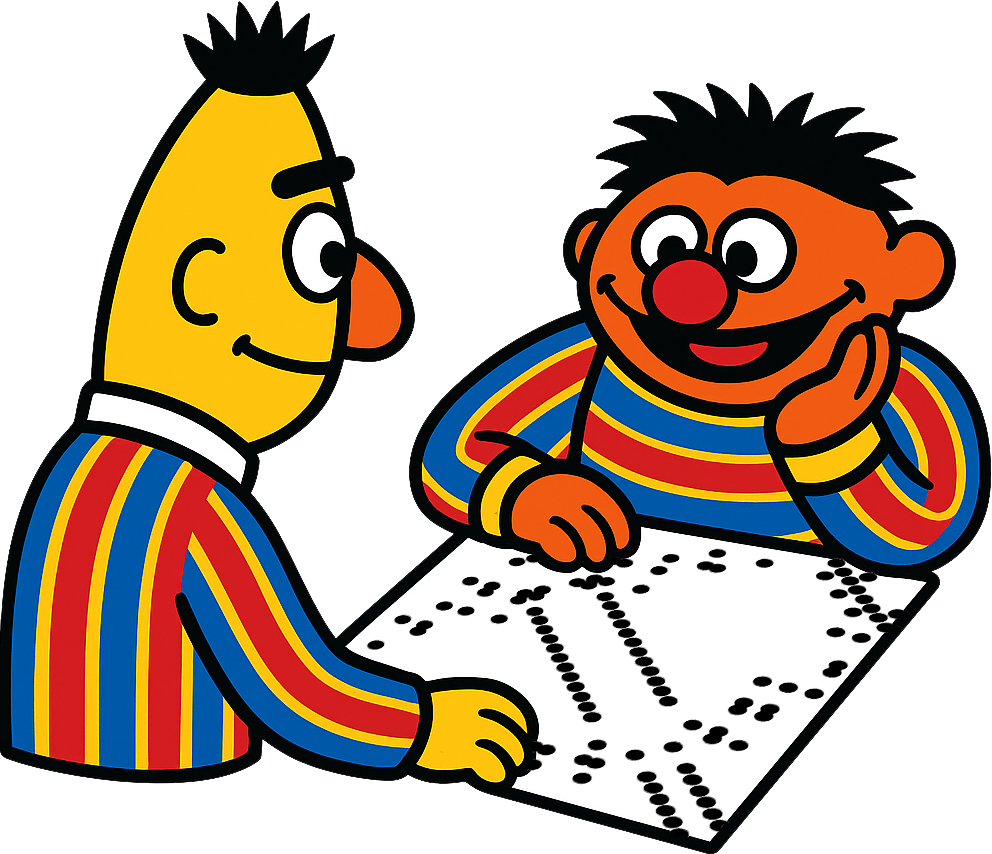

# MSA Pairformer (under construction will update soon)
<!--  -->
<div align="left">
  
</div>

[](https://colab.research.google.com/github/yoakiyama/MSA_Pairformer/blob/main/MSA_Pairformer_with_MMseqs2.ipynb/)

- [MSA Pairformer](#MSA-Pairformer)
  - [Installation ](#installation-)
  - [MSA Pairformer](#MSA-Pairformer--)
    - [Quickstart ](#quickstart--)
    - [Example Usage](#example-usage--)
  - [Licenses  ](#licenses--)
  - [Citations  ](#citations--)

This repository contains the latest release of MSA Pairformer and Google Colab notebooks for relevant analyses. Here, you will find how to use MSA Pairformer to embed protein sequences, predict residue-residue interactions in monomers and at the interface of protein-protein interactions, and perform zero-shot variant effect prediction.

## Installation <a name="installation"></a>

To get started with MSA Pairformer, install the python library using pip:

```bash
pip install msa-pairformer
```

or download this Github repository and install manually
```bash
git clone git@github.com:yoakiyama/MSA_Pairformer.git
pip install -e .
```

## MSA Pairformer <a name="MSA-Pairformer"></a>

[MSA Pairformer](https://arxiv.org/) extracts evolutionary signals most relevant to a query sequence from a set of aligned homologous sequences. Using only 111M parameters, it can easily run on consumer-grade hardware (e.g. NVIDIA RTX 4090) and achieve state-of-the-art performance. In this repository, we provide training code and Google Colab notebooks to reproduce the results in the pre-print. We are excited to deliver this tool to the research community and to see all of its applications to real-world biological challenges.

### Getting started with MSA Pairformer <a name="getting-started"></a>
The model's weights can be downloaded from Huggingface under [HuggingFace/yakiyama/MSA-Pairformer](https://huggingface.co/yakiyama/MSA-Pairformer/).
```py
from huggingface_hub import login
from MSA_Pairformer.model import MSAPairformer
import torch
import numpy as np

# Use the GPU if available
device = torch.device('cuda:0' if torch.cuda.is_available() else 'cpu')
print(f"Using device: {torch.cuda.get_device_name(device)}")

# This function will allow you to login to huggingface via an API key
login()

# Download model weights and load model
# As long as the cache doesn't get cleared, you won't need to re-download the weights whenever you re-run this
model = MSAPairformer.from_pretrained(device=device)

# You can also save the downloaded weights to a specified directory in your filesystem.
# Saving the model weights like so will allow you to load the model without re-downloading if your cache gets cleared.
# Once you run this code once, you can re-run and it will automatically load the weights
save_model_dir = "model_weights"
model = MSAPairformer.from_pretrained(weights_dir=save_model_dir, device=device)

# Subsample MSA using hhfilter and greedy diversification
np.random.seed(42)
msa_obj = MSA(
    msa_file_path=msa_file,
    max_seqs=max_msa_depth,
    max_length=total_length,
    max_tokens=1e12,
    diverse_select_method="hhfilter",
    hhfilter_kwargs={"binary": "hhfilter"}
)
msa_tokenized_t = msa_obj.diverse_tokenized_msa
  msa_onehot_t = torch.nn.functional.one_hot(msa_tokenized_t, num_classes=len(aa2tok_d)).unsqueeze(0).float().to(device)
  mask, msa_mask, full_mask, pairwise_mask = prepare_msa_masks(msa_obj.diverse_tokenized_msa.unsqueeze(0))
  mask, msa_mask, full_mask, pairwise_mask = mask.to(device), msa_mask.to(device), full_mask.to(device), pairwise_mask.to(device)
  
# Predict contacts and embed query sequence
results_dict = model.get_embeddings_and_contacts()
with torch.no_grad():
  with torch.amp.autocast(dtype=torch.bfloat16, device_type="cuda"):
      res = global_model(  # Use the pre-loaded global model
          msa=msa_onehot_t.to(torch.bfloat16),
          mask=mask,
          msa_mask=msa_mask,
          full_mask=full_mask,
          pairwise_mask=pairwise_mask,
          complex_chain_break_indices=[breaks],
          return_seq_weights=True,
          return_pairwise_repr_layer_idx=None,
          return_msa_repr_layer_idx=None
      )

  results.keys()
  # res is a dictionary with the following keys: final_msa_repr, final_pairwise_repr, msa_repr_d, pairwise_repr_d, seq_weights_list_d, logits, contacts, total_length, max_msa_depth, weight_scale


```

That's it -- you've generated embeddings and predicted contacts using MSA Pairformer!

## Licenses <a name="licenses"></a>

MSA Pairformer code and model weights are released under a permissive, slightly modified ☕️ MIT license. It can be freely used for both academic and commercial purposes.

## Citation <a name="citation"></a>
If you use MSA Pairformer in your work, please use the following citation
```
@article {Akiyama2025.08.02.668173,
	author = {Akiyama, Yo and Zhang, Zhidian and Mirdita, Milot and Steinegger, Martin and Ovchinnikov, Sergey},
	title = {Scaling down protein language modeling with MSA Pairformer},
	elocation-id = {2025.08.02.668173},
	year = {2025},
	doi = {10.1101/2025.08.02.668173},
	publisher = {Cold Spring Harbor Laboratory},
	URL = {https://www.biorxiv.org/content/early/2025/08/03/2025.08.02.668173},
	eprint = {https://www.biorxiv.org/content/early/2025/08/03/2025.08.02.668173.full.pdf},
	journal = {bioRxiv}
}

```
